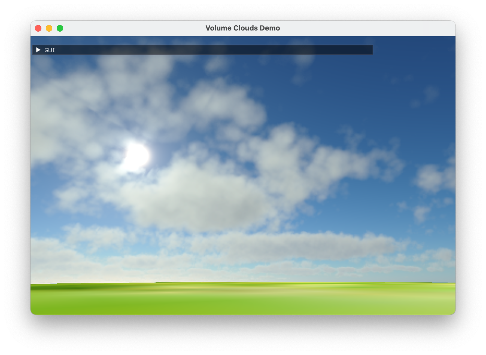

# OpenGL Starter

Used to quickly start an OpenGL demo.

|Demo|Screen Show|
|:--|:--|
|Volumetric Clouds||

## Usage

Include header:
```cpp
#include <vapp.h>
```

An application is declared using predefined marcos, wrapped in a class:

```cpp
BEGIN_APP_DECLARATION(Demo)
  virtual void Initialize(int argc, char** argv, const char* title);
  virtual void Display(bool auto_redraw);
  virtual void Resize(int width, int height);
  virtual void Finalize(void);
END_APP_DECLARATION()

DEFINE_APP(Demo, "title")
```

then define the class:

```cpp
void Demo::Initialize(int argc, char** argv, const char* title)
{
    base::Initialize( argc, argv, title /* [, int windowWidth = 1080, int windowHeight = 720] */ );

    // This method will be called at the beginning,
    // you can use it to initialize resources such as program, VBO, VAO etc.
    // glGenVertexArrays( 1, &VAO );
}
```
`Initialize` method will be called when the application starts.

In addition, we provider a `Program` class to create GL program:

```cpp
#include <LoadShaders.h>
    Program *program = new Program( "shaders/demo.vert", "shaders/demo.frag" );
```

The `Display` method will be called at every frame:

```cpp
void Triangle::Display(bool auto_redraw)
{
    // You can render what you want at here,
    // such as calling glDrawArrays.

    // Swap front and back buffers
    base::Display( auto_redraw );
}
```

Finally, `Resize` method is called when window is resized, and `Finalize` method is called when the application ends.
For full code, please see [examples/triangle/triangle.cpp](examples/triangle/triangle.cpp).

## Build

Create a `demo` folder at `examples` folder, then create a same name file at `demo` folder.
CMake will list all directories in `examples` folder, then find the same name cpp file for each directory.

In root directory, execute:

```sh
cmake -S . -B ./build && cmake --build ./build
```

then binary file will be compiled at `bin` folder:

```sh
./bin/demo
```
